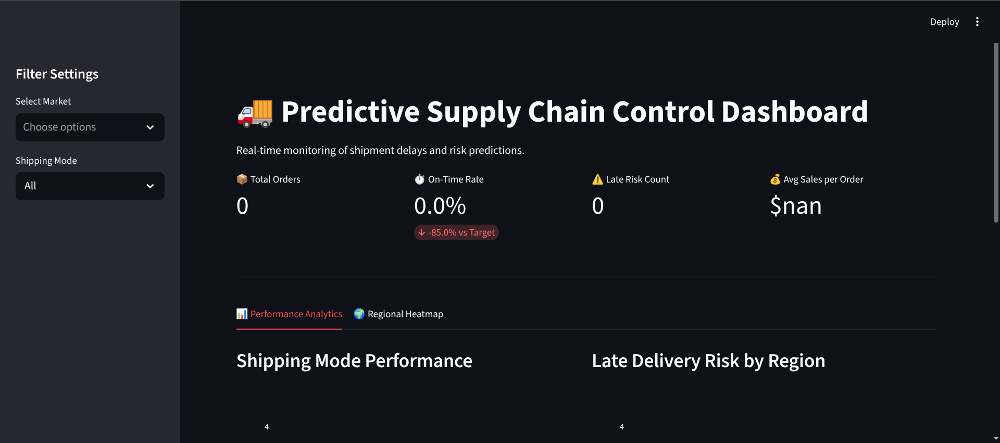
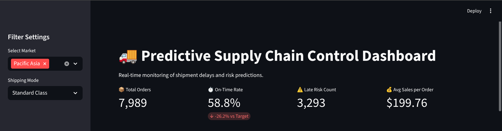
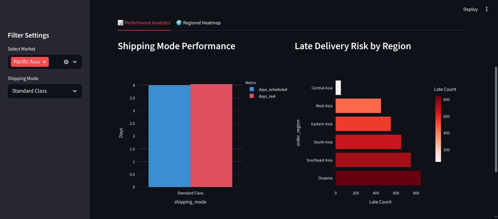
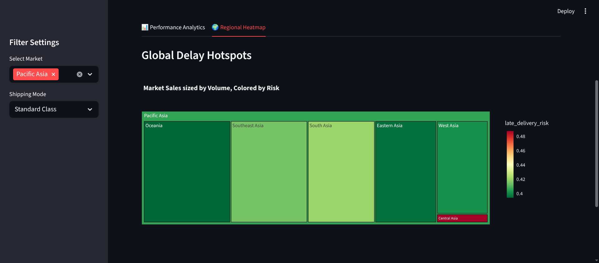

# 🚚 Predictive Supply Chain Control 


## 📌 Project Overview
This project implements an end-to-end **Data Engineering & Analytics** solution for supply chain management. It ingests raw logs, transforms them into a **Star Schema Data Warehouse**, and visualizes shipping risks via a real-time dashboard.

The system helps logistics managers identify **late delivery risks** before shipment, potentially saving **$14k annually** by optimizing shipping modes in high-risk regions.

## 📂 Data Source
* **Dataset:** [DataCo Smart Supply Chain for Big Data Analysis](https://www.kaggle.com/datasets/shashwatwork/dataco-smart-supply-chain-for-big-data-analysis)
* **File Used:** `DataCoSupplyChainDataset.csv`
* **Volume:** ~180k Records

## 🏗️ Architecture
1. **ETL Pipeline (`etl_engine.py`):**
   - **Extract:** Reads raw CSV (handles encoding errors).
   - **Transform:** Cleanses data and normalizes it into 3 Dimensions (`Customer`, `Product`, `Location`) and 1 Fact Table (`Orders`).
   - **Load:** Ingests data into a SQLite database.
2. **Data Warehouse (`schema_queries.sql`):**
   - Relational Star Schema designed for analytical querying.
3. **Control Tower (`app.py`):**
   - Streamlit dashboard connecting directly to the SQL warehouse.
   
## 📸 Dashboard Preview






## ⚙️ How to Run
1. **Clone the repository:**
   ```bash
   git clone [https://github.com/aditya-rudre/Supply-Chain-Control.git](https://github.com/aditya-rudre/Supply-Chain-Control.git)
